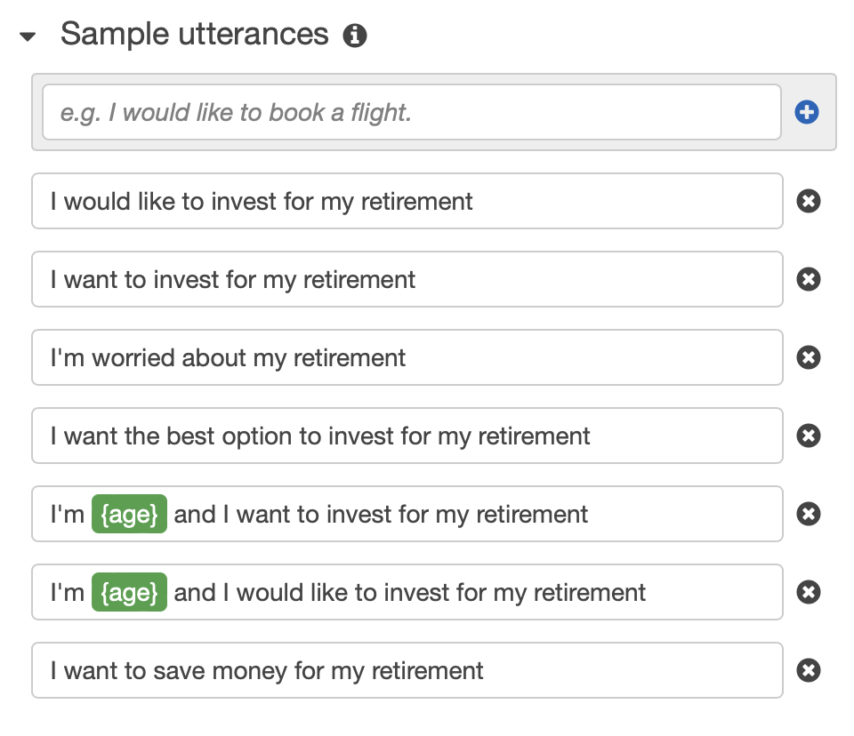
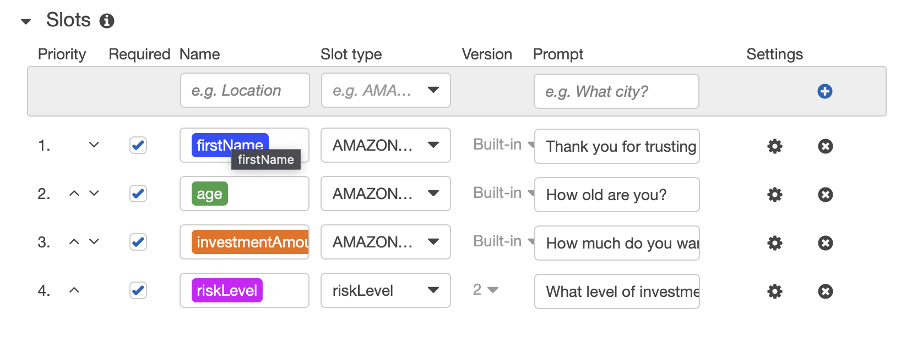

# RoboAdvisor ChatBot

## Files
[Amazon Lex Console](https://github.com/kyleplathe/unit13-challenge/blob/main/RoboAdvisor/RoboAdvisor_Lex_Console.zip)

[AWS Lambda .py file](https://github.com/kyleplathe/unit13-challenge/blob/main/RoboAdvisor/AWS_lambda.py)

[Screen Recording of ChatBot](https://github.com/kyleplathe/unit13-challenge/blob/main/images/RoboAdvisor_video.mov)

## Sample Utterances

## Custom Slots

## Testing Lambda

## Successful Testing
